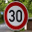

#**Traffic Sign Recognition**


**Build a Traffic Sign Recognition Project**

The goals / steps of this project are the following:
* Load the data set (see below for links to the project data set)
* Explore, summarize and visualize the data set
* Design, train and test a model architecture
* Use the model to make predictions on new images
* Analyze the softmax probabilities of the new images
* Summarize the results with a written report


[//]: # (Image References)

[image1]: ./writeup_images/class_histogram.png "Class Histogram"
[image2]: ./writeup_images/preprocessing.png "Image Preprocessing"
[image4]: ./web_images/lights.jpeg "Traffic lights ahead"
[image5]: ./web_images/limit30.jpeg "Speed Limit 30 km/h"
[image6]: ./web_images/roundabout.jpeg "Roundabout Mandatory"
[image7]: ./web_images/STOP.jpeg "STOP"
[image8]: ./web_images/Yield.jpeg "Yield"
[image9]: ./writeup_images/logit_bars.png "Barcharts of logits"

## Rubric Points
###Here I will consider the [rubric points](https://review.udacity.com/#!/rubrics/481/view) individually and describe how I addressed each point in my implementation.  

---
###Writeup / README

####1. Provide a Writeup / README that includes all the rubric points and how you addressed each one. You can submit your writeup as markdown or pdf. You can use this template as a guide for writing the report. The submission includes the project code.

You're reading it! and here is a link to my [project code](https://github.com/SvenKratz/CarND-Traffic-Sign-Classifier-Project/blob/master/Traffic_Sign_Classifier.ipynb)

###Data Set Summary & Exploration

####1. Provide a basic summary of the data set. In the code, the analysis should be done using python, numpy and/or pandas methods rather than hardcoding results manually.

In cell #2 I calculated some basic summary statistics using basic Python, and ``np.unique`` to calculate the unique number of classes from ``y_train``. Here is the output from the code

```
Number of training examples = 34799
Number of testing examples = 12630
Number of validation exanples = 4410
Image data shape = (32, 32, 3)
Number of classes = 43
```

####2. Include an exploratory visualization of the dataset.

The following chart is an exploratory visualization of the data set. It is a histogram showing the counts of class labels within the training set. It is evident that the dataset is unbalanced, which may have adverse affects on classification. Strategies to mitigate this would be to either cull the data set to ensure equal amounts of training labels, or to synthesize additional data. For the purpose of this project, however, I decided to go ahead and train a deep neural network on the existing data and to get an impression of the accuracy first. It turns out that my network was sufficiently accurate even without additional engineering on the data set.

![alt text][image1]

###Design and Test a Model Architecture

####1. Describe how you preprocessed the image data. What techniques were chosen and why did you choose these techniques? Consider including images showing the output of each preprocessing technique. Pre-processing refers to techniques such as converting to grayscale, normalization, etc. (OPTIONAL: As described in the "Stand Out Suggestions" part of the rubric, if you generated additional data for training, describe why you decided to generate additional data, how you generated the data, and provide example images of the additional data. Then describe the characteristics of the augmented training set like number of images in the set, number of images for each class, etc.)

At first I tried training the model with RGB images, and applied the naive contrast enhancing method proposed in the assignment. Performance was not optimal, so I tried just grayscale images, which seemed to work better. Transforming RGB to Grayscale requires some care to preserve contrast. I used the OpenCV ``cv2.cvtColor`` function in ``cv2.COLOR_RGB2GRAY`` conversion mode, which converts it with a formula that preserved correct contrast perception between the color channels:

Gray(R,G,B) = 0.299⋅R + 0.587⋅G+0.114⋅B

Some images in the dataset were photographed under low-light conditions or with low contrast. Therefore I applied [Histogram Equalization](https://en.wikipedia.org/wiki/Histogram_equalization) using the OpenCV ``cv2.equalizeHist`` function to maximize the distribution of contrast in the input images. Below is an example of this transformation on one of images from the training set which clearly shows an improvement in image quality:

![alt text][image2]


####2. Describe what your final model architecture looks like including model type, layers, layer sizes, connectivity, etc.) Consider including a diagram and/or table describing the final model.

My final model consisted of the following layers (cell #37):

| Layer         		|     Description	        					|
|:---------------------:|:---------------------------------------------:|
| Input         		| 32x32x1 Grayscale image   							|
| Convolution 16x16x32     	| 1x1 stride, valid padding, outputs 17x17x64 	|
| RELU					|												|
| Max pooling	2x2      	| 2x2 stride, valid padding, outputs 8x8x64 				|
| Convolution 5x5x64    | 1x1 stride, valid padding, outputs 5x5x64     									|
| Relu	|        									|
| Max pooling 2x2				| 2x2 stride, valid padding, outputs 2x2x64         									|
|Flatten |	transform from 2D to flat data 256x1					|
|Fully connected 256x128 | fully connected layer |
| Relu | |
|Dropout (p_keep = 0.8) | dropout layer |
|Fully connected 128x100 | fully connected layer |
| Relu | |
| Dropout (p_keep = 0.8)  | dropout layer |
|Fully connected 128x43 | Final layer with class logits |
| Softmax | logits interpreted through SoftMax function |


####3. Describe how you trained your model. The discussion can include the type of optimizer, the batch size, number of epochs and any hyperparameters such as learning rate.

I trained the model on an Nvidia TitanX GPU with 12 GB VRAM. To train the model, I used an Adam optimizer with a learning rate of 0.0001, a batch size of 128 and a maximum 512 epochs. To save some time, I added code to stop training once an accuracy >0.943 is reached, which is well above the required 0.93. I had originally used a higher learning rate and less epochs, but the accuracy was below 0.93, so I used the advice from the video lectures to decrease the learning rate to improve the accuracy. The batch size was set to the relatively low value of 128 due to memory constraints with my GPU. My architecture uses a total of dropout nodes, one after each of the first two fully connected layers. I set the keep probability (p_keep) to a non-agressive value 0.8, as the training set is not particularly large.


####4. Describe the approach taken for finding a solution and getting the validation set accuracy to be at least 0.93. Include in the discussion the results on the training, validation and test sets and where in the code these were calculated. Your approach may have been an iterative process, in which case, outline the steps you took to get to the final solution and why you chose those steps. Perhaps your solution involved an already well known implementation or architecture. In this case, discuss why you think the architecture is suitable for the current problem.

My final model results (cell #45) were:
* training set accuracy of 1.0
* validation set accuracy of 0.944
* test set accuracy of 0.914

I chose an iterative approach to arrive at a solution to the assignment. I started with the LeNet example implementation that was provided with the assignment. This architecture had problems as it wasn't yielding a satisfactory accuracy (I believe it was only around 0.4 initially).

Looking more closely at the LeNet architecture, which was developed in 1998, I noticed that some modern features of deep neural networks are missing, notably dropout. Also, the initial convolutions in LeNet have rather small kernels and shallow outputs, so I changed the first convolution from 5x5x6 to 16x16x32, and deepened the second convolution from 5x5x16 to 5x5x64. This gives the network a large number of filters to use for initial image processing.

The rest of my architecture follows the basic LeNet architecture, although I added dropout layers after each of the first two fully connected layers to improve generalization and slightly modified the dimensionality of the fully connected layers to accept the input from the convolutional layers, i.e., flattened 256 dimensional inputs vs. 400 dimensional in the original. Relu activations were used throughout the model, except for the last layer, where a SoftMax function is applied to the logits.

As the model was oscillating in a widely-spaced (e.g., >0.02) accuracy range, I decided to lower the training rate to 0.0001, and run more epochs, i.e., 512 vs. my initial choice of 256. This led to an almost continuous growth in accuracy even in the late epochs. I set the batch size to 128, although I would have preferred larger sizes, but was constrained due to memory issues with my GPU.

As expected the model performs flawlessly on the training set, indicating that it is fully trained. It achieves the required >0.93 accuracy on the validation set and 0.914 on the test set, indicating slight but acceptable overfitting with respect to the validation set.


###Test a Model on New Images

####1. Choose five German traffic signs found on the web and provide them in the report. For each image, discuss what quality or qualities might be difficult to classify.

Here are five German traffic signs that I found on the web. These images have been cropped and scaled to 32x32 from the originals found on the web.

</img>
</img>
</img>
</img>
</img>


The first ("traffic light") is difficult to classify, as it is very similar to the "General Caution" sign, that has the same triangular layout but an exclamation mark in the middle. The dot of the exclamation mark may easily be misinterpreted as one of the circles of the traffic light.

The speed limit sign may also be prone to misinterpretation as all the speed limit signs share the same geometric layout and only differ in the numerals displayed on the sign.

The yield sign is distinct in that it is an inverted triangle, however, other signs exist (e.g., "children crossing") that are upright triangles with the same coloring.

The roundabout sign is fairly distinct, but shares geometry with other round "mandatory" signs.

Finally, the STOP sign is very distinct as it is the only octagonal sign in the data set.

####2. Discuss the model's predictions on these new traffic signs and compare the results to predicting on the test set. At a minimum, discuss what the predictions were, the accuracy on these new predictions, and compare the accuracy to the accuracy on the test set (OPTIONAL: Discuss the results in more detail as described in the "Stand Out Suggestions" part of the rubric).

Here are the results of the prediction (cell #53):

| Image			        |     Prediction	        					|
|:---------------------:|:---------------------------------------------:|
| Lights     		| General Caution   									|
| Speed Limit 30     			| Speed Limit 30 										|
| Yield					| Yield											|
| STOP	      		| STOP					 				|
| Roundabout Mandatory			| Roundabout Mandatory     							|


The model was able to correctly guess 4 of the 5 traffic signs, which gives an accuracy of 80%. This compares favorably to the accuracy on the test set of 0.914, although the number of examples here is too low to give an accurate comparison to the test set.

####3. Describe how certain the model is when predicting on each of the five new imaglogites by looking at the softmax probabilities for each prediction. Provide the top 5 softmax probabilities for each image along with the sign type of each probability. (OPTIONAL: as described in the "Stand Out Suggestions" part of the rubric, visualizations can also be provided such as bar charts)

The code for making predictions on my final model is located in the "Output Top 5 Softmax..." section of the Ipython notebook. This section also includes the code for plotting the logits as bar charts.

The following image shows bar charts of the top 5 logits for each image:

![alt text][image9]

For the first image, the model is relatively sure that this is a stop sign (probability of 0.6), and the image does contain a stop sign. The top five soft max probabilities were

For images "Limit30", "Yield", "Stop", the model was relatively unambiguous, giving high probabilities for the final result.

For the image "Lights", the model made a false prediction. This is exacerbated by the fact that the correct prediction is only the top 3rd logit. This shows that this class of images needs additional training. This is surprising as correct class "Traffic signals" is one of the classes that in the training data set that has a high count.

The image "Roundabout" seems to have been barely classified correctly by the classifier, with a logit score of just around 25, with significant scores for competing classes.

### (Optional) Visualizing the Neural Network (See Step 4 of the Ipython notebook for more details)
####1. Discuss the visual output of your trained network's feature maps. What characteristics did the neural network use to make classifications?

Did not complete the optional part of the assignment.
